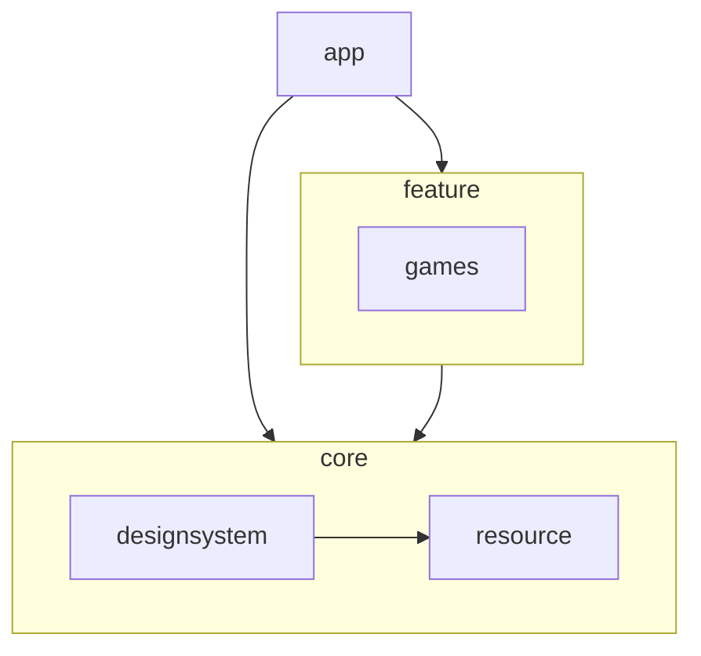

# MultiModule
This is an example project of how to easily configure a multi-module project with Convention Plugins.

## Modules

```mermaid
flowchart TD
	subgraph feature
		games
	end

	subgraph core
		designsystem --> resource
	end

	app --> feature
	app --> core
	feature --> core
```